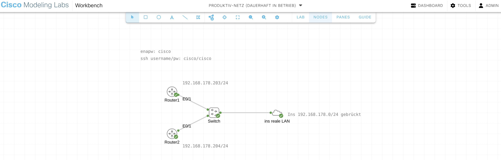

# Lab - Erstellen einer CI/CD-Pipeline zum Testen der Ansible-Konfiguration in einem CML-Netzwerk


**Angepasst für: Linux Mint + GitHub + CML Personal 2.9**

## Überblick

### Berufliche Aufgabenstellung

Sie sind Fachinformatiker in einem Unternehmen und verantwortlich für die Verwaltung der Netzwerk-Sicherheitskonfigurationen. Ihre Aufgabe ist es, Access Control Lists (ACLs) auf Routern zu konfigurieren und zu pflegen. 

**Herausforderung:** Manuelle Konfigurationsänderungen sind fehleranfällig und zeitaufwändig. Jede Änderung muss getestet werden, bevor sie im Produktiv-Netzwerk ausgerollt wird. Die bisherige Methode – manuelle Tests in einem separaten Testaufbau – ist ineffizient und führt zu langen Änderungszyklen.

**Lösung:** Sie implementieren eine automatisierte CI/CD-Pipeline (Continuous Integration/Continuous Deployment), die:
1. **Konfigurationen als Code verwaltet** (Infrastructure as Code mit Ansible)
2. **Änderungen automatisch testet** in einem virtualisierten Testnetzwerk
3. **Validierte Konfigurationen automatisch ausrollt** ins Produktiv-Netzwerk

### Anforderungen an die Pipeline

Die Pipeline durchläuft bei jeder Änderung folgende Phasen:

```
Entwickler/Engineer macht ACL-Änderung
  ↓
Commit & Push zu GitHub (Branch: test)
  ↓
╔═══════════════════════════════════════════════════════╗
║  AUTOMATISCHE TEST-PHASE (in GitHub Actions)          ║
╠═══════════════════════════════════════════════════════╣
║  1. Start Test-Netzwerk in CML                        ║
║     → 2 virtuelle Cisco Router werden gestartet       ║
║                                                       ║
║  2. Deploy ACL-Konfiguration auf Test-Router          ║
║     → Ansible wendet neue ACL an                      ║
║                                                       ║
║  3. Automatische Tests (pyATS)                        ║
║     → Konnektivitätstests                             ║
║     → Funktionsprüfung                                ║
║                                                       ║
║  4. Cleanup: Test-Netzwerk wird gelöscht              ║
╚═══════════════════════════════════════════════════════╝
  ↓
Tests erfolgreich? 
  ↓
Pull Request: test → main
  ↓
Review & Merge
  ↓
╔═══════════════════════════════════════════════════════╗
║  AUTOMATISCHE DEPLOYMENT-PHASE DER PRODUKIV-UMGEBUNG  ║
╠═══════════════════════════════════════════════════════╣
║  1. Ansible deployed ACL auf Produktiv-Router         ║
║     → Konfiguration wird ausgerollt                   ║
║                                                       ║
║  2. Verifizierung                                     ║
║     → Deployment-Status wird geprüft                  ║
╚═══════════════════════════════════════════════════════╝
  ↓
Produktiv-Umgebung ist aktualisiert! 
```

### Labor-Umgebung

**In diesem Lab simulieren wir ein realistisches Szenario:**

| Umgebung | Beschreibung | Technologie | Automatisierung |
|----------|--------------|-------------|-----------------|
| **Test-Netzwerk** | Automatisch erstelltes virtuelles Netzwerk für Tests | CML (2 virtuelle Router - nur temporär vorhanden) | Wird bei jedem Test-Lauf neu erstellt & gelöscht |
| **Produduktiv-Netzwerk** | Simuliertes "Produktiv-Netzwerk" für das Labor | CML (2 virtuelle Router - dauerhaft vorhanden) | Konfiguration wird automatisch deployed |

**Wichtig zu verstehen:**
- **Test-Netzwerk:** Wird **dynamisch** in CML erstellt (on-demand), getestet und wieder gelöscht
- **Produktiv-Netzwerk:** Läuft **permanent** in CML und simuliert Ihr "echtes" Netzwerk
- **In der Realität** würde das Produktiv-Netzwerk auf echter Hardware laufen
- **In diesem Lab** nutzen wir CML für beide Umgebungen, um die Infrastruktur zu simulieren

**Warum diese Aufteilung?**
```
Test-Netzwerk (temporär):
  ├─ Isolierte Umgebung für Experimente
  ├─ Kann ohne Risiko zerstört werden
  ├─ Automatisch erstellt/gelöscht
  └─ Validiert Änderungen vor Production

Production-Netzwerk (dauerhaft):
  ├─ Simuliert Ihr "echtes" Unternehmensnetzwerk
  ├─ Änderungen nur nach erfolgreichen Tests
  ├─ Läuft kontinuierlich
  └─ Erhält nur geprüfte Konfigurationen
```

### Technologie-Stack

**Was Sie in diesem Lab lernen und nutzen:**

| Komponente | Zweck | Technologie |
|------------|-------|-------------|
| **Infrastructure as Code** | Netzwerkkonfiguration als versionierte Dateien | Ansible + YAML |
| **Virtualisierung** | Netzwerk-Simulation | Cisco Modeling Labs (CML) 2.9 |
| **Versionskontrolle** | Code-Management und Kollaboration | Git + GitHub |
| **CI/CD-Plattform** | Automatisierung der Pipeline | GitHub Actions |
| **Test-Automation** | Automatische Netzwerk-Tests | pyATS/Genie |
| **Deployment-Automation** | Automatisches Konfigurationsmanagement | Ansible |

### Nutzen für die Praxis

Nach Abschluss dieses Labs können Sie:

1. **Schnellere Änderungszyklen**
   - Statt Stunden/Tage nur noch Minuten bis zur Production-Deployment
   - Automatische Tests eliminieren manuelle Testphasen

2. **Höhere Qualität**
   - Jede Änderung wird automatisch getestet
   - Fehler werden erkannt, bevor sie das Produktiv-Netz erreichen
   - Konsistente Konfigurationen durch Code

3. **Bessere Nachvollziehbarkeit**
   - Alle Änderungen sind in Git dokumentiert
   - Wer hat wann was geändert? → Git History
   - Einfaches Rollback bei Problemen

4. **Skalierbarkeit**
   - Gleicher Prozess für 2 oder 200 Router
   - Parallele Deployments möglich
   - Wiederverwendbare Workflows

### Repository-Struktur

```
~/cml-as-code-ansible/              # Git Repository
├── venv/                           # Python-Umgebung (LOKAL)
├── ansible.cfg                     # Ansible SSH-Konfiguration
├── acl-config.yaml                 # ACL-Definition (Infrastructure as Code)
├── testbed.yaml                    # pyATS Testbed-Definition
├── test.py                         # Automatisierter Konnektivitätstest
├── python/
│   ├── test-network.py            # CML Test-Netzwerk Management
│   ├── ansible-test-lab.yaml      # CML Topologie für Tests
│   └── requirements.txt           # Python-Dependencies
├── ansible/
│   ├── deploy-acl-config.yaml     # Ansible Playbook
│   ├── test-network.yaml          # Test-Router Inventar
│   └── production-network.yaml    # Production-Router Inventar
├── .github/
│   └── workflows/
│       └── ci-cd.yml              # CI/CD-Pipeline Definition
└── .gitignore
```

### Lernziele

Nach Abschluss dieses Labs können Sie:
- Netzwerkkonfigurationen mit Ansible als Code verwalten
- Eine vollständige CI/CD-Pipeline für Netzwerk-Automation aufbauen
- CML-Umgebungen programmatisch erstellen und verwalten
- Automatisierte Tests mit pyATS/Genie implementieren
- GitHub Actions für Infrastructure-Workflows einsetzen
- Infrastructure as Code Best Practices anwenden
- Test- und Produktiv-Umgebungen professionell trennen

---

## Voraussetzungen

### Informationen die Sie benötigen

**Bevor Sie beginnen, ermitteln Sie:**

1. **CML-Server:**
   - IP-Adresse: z.B. `https://192.168.178.31`
   - Username: z.B. `IhrUsername`
   - Password: z.B. `IhrPassword`

2. **Test-Netzwerk Router IPs:**
   - Router 1: z.B. `192.168.178.201`
   - Router 2: z.B. `192.168.178.202`

3. **Produktiv-Netzwerk Router IPs:**
   - Router 1: z.B. `192.168.178.203`
   - Router 2: z.B. `192.168.178.204`
   - [CML-yaml-Datei](../01-why-automation/code/Produktiv-Netz_(dauerhaft_in_Betrieb)-Vorlage.yaml), geeignet für cml4free



> **Wichtiger Hinweis:** Zur Erprobung der Laborübung wurden die priv. IP-Adressen eines Heimnetzwerks verwendet: CML-Server `192.168.178.31`. Das virtualisierte Netz ist mit dem realen Netz gebridged. Beide Netze verwenden also das gleiche IP-Netz `192.168.178.0/24`. Sie müssen die IPs an Ihre Umgebung entsprechend anpassen!

---

## Teil 1: Entwicklungsumgebung einrichten

### Schritt 1: System-Pakete installieren

```bash
# Terminal öffnen
sudo apt update
sudo apt upgrade -y

# Python 3.8 (diese Version für pyATS)
sudo apt install python3.8 python3.8-venv python3.8-dev -y

# Build-Tools
sudo apt install build-essential libssl-dev libffi-dev -y

# Git
sudo apt install git -y

# SSH-Client
sudo apt install openssh-client -y

# Verifizieren
python3.8 --version
git --version
```

### Schritt 2: Git konfigurieren

```bash
git config --global user.name "Ihr Name"
git config --global user.email "ihre.email@example.com"
```

### Schritt 3: GitHub-Repository erstellen

**Auf GitHub:**
1. **+** → **New repository**
2. Name: `cml-as-code-ansible`
3. - Add README
4. - Add .gitignore: Python
5. Create repository

### Schritt 4: SSH-Key erstellen und zu GitHub hinzufügen

#### SSH-Key erstellen (Ed25519 - moderner Standard)
ssh-keygen -t ed25519 -C "ihre.email@example.com"

#### Bei den Fragen:
- Enter file in which to save the key: [Enter] (Standard: ~/.ssh/id_ed25519)
- Enter passphrase: [Enter] oder ein Passwort (empfohlen!)
- Enter same passphrase again: [Enter] oder Passwort wiederholen

**Erwartete Ausgabe:**
```
Generating public/private ed25519 key pair.
Enter file in which to save the key (/home/michael/.ssh/id_ed25519): 
Enter passphrase (empty for no passphrase): 
Enter same passphrase again: 
Your identification has been saved in /home/michael/.ssh/id_ed25519
Your public key has been saved in /home/michael/.ssh/id_ed25519.pub
The key fingerprint is:
SHA256:abcdef1234567890... ihre.email@example.com
```

> **Tipp:** Wenn Sie bereits einen SSH-Key haben, können Sie diesen wiederverwenden!

#### **4.2: Public Key anzeigen**

```bash
# Public Key anzeigen
cat ~/.ssh/id_ed25519.pub
```

**Kopieren Sie die komplette Ausgabe!** Sie sollte beginnen mit:
```
ssh-ed25519 AAAAC3NzaC1lZDI1NTE5AAAA... ihre.email@example.com
```

#### **4.3: SSH-Key zu GitHub hinzufügen**

**Auf GitHub:**

1. Klicken Sie oben rechts auf Ihr **Profilbild** → **Settings**
2. Links: **SSH and GPG keys**
3. Klicken Sie **New SSH key**
4. **Title:** z.B. "Linux Mint - CML Lab"
5. **Key type:** Authentication Key
6. **Key:** Fügen Sie den kopierten Public Key ein
7. Klicken Sie **Add SSH key**
8. Bestätigen Sie ggf. mit Ihrem GitHub-Passwort

#### **4.4: SSH-Verbindung zu GitHub testen**

```bash
# GitHub SSH-Verbindung testen
ssh -T git@github.com
```

**Beim ersten Mal erscheint:**
```
The authenticity of host 'github.com (...)' can't be established.
...
Are you sure you want to continue connecting (yes/no/[fingerprint])? 
```

**Antworten Sie:** `yes`

**Erwartete Ausgabe:**
```
Hi IHREN-USERNAME! You've successfully authenticated, but GitHub does not provide shell access.
```
---

### Schritt 5: Repository klonen (mit SSH!)

```bash
cd ~

# Repository klonen mit SSH URL (NICHT HTTPS!)
git clone git@github.com:IHREN-USERNAME/cml-as-code-ansible.git

cd cml-as-code-ansible
git status
```

> **Wichtig:** Die URL beginnt mit `git@github.com:` (SSH) statt `https://github.com/` (HTTPS)!

**Falls Sie bereits mit HTTPS geklont haben:**
```bash
cd ~/cml-as-code-ansible

# Remote URL auf SSH umstellen
git remote set-url origin git@github.com:IHREN-USERNAME/cml-as-code-ansible.git

# Verifizieren
git remote -v
# Sollte zeigen: git@github.com:IHREN-USERNAME/cml-as-code-ansible.git
```

---

## Teil 2: Python-Umgebung einrichten

### Schritt 7: Virtual Environment erstellen

```bash
cd ~/cml-as-code-ansible

python3.8 -m venv venv

source venv/bin/activate
```

**Sie sollten sehen:** `(venv)` vor Ihrem Prompt

### Schritt 8: Python-Dependencies definieren

```bash
mkdir python
cd python
nano requirements.txt
```

**Inhalt von `requirements.txt`:**
```
ansible==2.13.13
pyats==24.11
genie==24.11
virl2-client==2.8.0
paramiko==3.5.0
```

**Speichern:** `Strg+O`, `Enter`, `Strg+X`

### Schritt 9: Dependencies installieren

```bash
pip install --upgrade pip
pip install -r requirements.txt
```

**Verifizieren:**
```bash
ansible --version
python -c "from virl2_client import ClientLibrary; print('virl2-client OK')"
```

---

## Teil 3: CML Test-Netzwerk-Management Setup

### Schritt 10: Test-Netzwerk Python-Script erstellen

```bash
nano test-network.py
```

**Inhalt:**
```python
from virl2_client import ClientLibrary
import sys

CML_SERVER = "https://xxx.xxx.xxx.xxx"  # ANPASSEN!
LAB_FILE = "ansible-test-lab.yaml"
CML_USER = "YourUser"  # ANPASSEN!
CML_PASS = "YourPW"  # ANPASSEN!
LAB_NAME = "Test-Netz"  # 

client = ClientLibrary(CML_SERVER, CML_USER, CML_PASS, ssl_verify=False)

def start_network():
    try:
        # Load the lab from a local file
        with open(LAB_FILE, "r") as lab_file:
            lab = client.import_lab(lab_file.read())

        print("Das Test-Lab wurde hergestellt!")
        print("Die Nodes werden nun gestartet...")
        # Start the lab
        lab.start()

        print("Das Test-Lab wurde gestartet")
        print("Lab ID:", lab.id)
    except Exception as e:
        print("An error occurred:", str(e))

def remove_network():
    try:
        print(f"Checking if '{LAB_NAME}' exists for removal...")
        labs = list(client.find_labs_by_title(LAB_NAME))
        
        # Warnung wenn kein Lab gefunden wurde
        if not labs:
            print(f"WARNING: No lab found with title '{LAB_NAME}'")
            return
            
        for lab in labs:
            print(f"Lab wird entfernt {lab}")
            lab.stop()
            lab.wipe()
            lab.remove()
            print("Lab wurde erfolgreich entfernt")
    except Exception as e:
        print("An error occurred:", str(e))

if __name__ == "__main__":
    if len(sys.argv) != 2:
        print("Usage: python script.py [up/down]")
        sys.exit(1)

    action = sys.argv[1]
    if action == "up":
        start_network()
    elif action == "down":
        remove_network()
    else:
        print("Invalid argument. Use 'up' to start the network or 'down' to remove it.")
        sys.exit(1)
```

**Speichern:** `Strg+O`, `Enter`, `Strg+X`

> **Wichtig:** Passen Sie `CML_SERVER`, `CML_USER` und `CML_PASS` an Ihre Umgebung an!

### Schritt 11: CML Topologie-Datei erstellen

Diese Datei finden Sie in Ihrem Vorlagen-Ordner oder erstellen sie in CML und exportieren sie.

```bash
nano ansible-test-lab.yaml
```

**Minimale Struktur** (vollständige YAML aus Vorlagen-Ordner verwenden):
```yaml
lab:
  title: Test-Netz  # Muss mit LAB_NAME übereinstimmen!
  description: Test-Netz für Validierung vor Produktivlauf
  version: 0.3.0

nodes:
  - id: n0
    label: Router1
    node_definition: iol-xe
    # ... weitere Konfiguration
    
  - id: n1
    label: Router2
    node_definition: iol-xe
    # ... weitere Konfiguration

# ... Links, Annotations, etc.
```

> **Tipp:** Die vollständige YAML-Datei finden Sie in den Vorlagen oder exportieren Sie ein vorbereitetes Lab aus CML!

---

## Teil 4: Ansible-Konfiguration Setup

### Schritt 12: Ansible-Verzeichnis erstellen

```bash
cd ~/cml-as-code-ansible
mkdir ansible
cd ansible
```

### Schritt 13: Test-Network Inventar erstellen

```bash
nano test-network.yaml
```

**Inhalt:**
```yaml
routers:
  hosts:
    router1:
      ansible_host: xxx.xxx.xxx.xxx  # ANPASSEN!
    router2:
      ansible_host: xxx.xxx.xxx.xxx  # ANPASSEN!
  vars:
    ansible_network_os: ios
    ansible_user: YoursshUser
    ansible_password: YoursshPW
    ansible_connection: network_cli
    ansible_become: yes
    ansible_become_method: enable
    ansible_become_password: Yourenapw
```

### Schritt 14: Produktiv-Network Inventar erstellen

```bash
nano production-network.yaml
```

**Inhalt:**
```yaml
routers:
  hosts:
    router1:
      ansible_host: xxx.xxx.xxx.xxx  # ANPASSEN!
    router2:
      ansible_host: xxx.xxx.xxx.xxx  # ANPASSEN!
  vars:
    ansible_network_os: ios
    ansible_user: YoursshUser
    ansible_password: YoursshPW
    ansible_connection: network_cli
    ansible_become: yes
    ansible_become_method: enable
    ansible_become_password: Yourenapw
```

### Schritt 15: Ansible Playbook erstellen

```bash
nano deploy-acl-config.yaml
```

**Inhalt:**
```yaml
---
- name: Configure ACL on Cisco routers
  hosts: routers
  gather_facts: no

  tasks:
    - name: Include ACL vars
      include_vars: '../acl-config.yaml'

    - name: Remove old ACL from interface (if exists)
      cisco.ios.ios_config:
        lines:
          - no ip access-group {{ acl[0].acls[0].name }} in
        parents: interface {{ acl_interface[0].name }}
      ignore_errors: yes

    - name: Remove old ACL (if exists)
      cisco.ios.ios_config:
        lines:
          - no ip access-list extended {{ acl[0].acls[0].name }}
      ignore_errors: yes

    - name: Build ACL rules from config
      set_fact:
        acl_rules: "{{ acl_rules | default([]) + [item.sequence | string + ' ' + item.grant + ' ' + item.protocol + ' ' + item.source.address + ' ' + item.destination.address + ((' eq ' + item.destination.port_protocol.eq) if item.destination.port_protocol is defined else '')] }}"
      loop: "{{ acl[0].acls[0].aces }}"
      loop_control:
        label: "{{ item.sequence }}"

    - name: Create ACL
      cisco.ios.ios_config:
        lines: "{{ acl_rules }}" 
        parents: ip access-list extended {{ acl[0].acls[0].name }}
        save_when: modified

    - name: Apply ACL to interface
      cisco.ios.ios_config:
        lines:
          - ip access-group {{ acl[0].acls[0].name }} {{ acl_interface[0].access_groups[0].acls[0].direction }}
        parents: interface {{ acl_interface[0].name }}
        save_when: modified
```

**Hinweise zur Konfiguration**
- Dynamisches Lesen aus `acl-config.yaml` mit `set_fact`
- Unterstützt beliebige ACL-Regeln ohne Code-Änderungen
- Verwendet `ios_config` statt `ios_acls` (IOL-Router Kompatibilität)

---

### Technischer Hintergrund: Warum ios_config statt ios_acls?

**Wichtig für das Verständnis der Architekturentscheidung:**

Dieses Lab verwendet **IOL-XE Router** (`node_definition: iol-xe`) in CML. Diese Router haben besondere Anforderungen:

#### **Strukturierte Module (ios_acls/ios_acl_interfaces) - nicht empfohlen für IOL:**

```yaml
# Funktioniert NUR zuverlässig mit echten IOS-XE Geräten (CSR1000v)
- name: Create ACL 
  cisco.ios.ios_acls:
    config: "{{ acl }}"
    state: overridden
```

**Probleme bei IOL-Routern:**
- Prompt-Handling Fehler (`Router(config)#` statt `Router#`)
- Session bleibt im Config-Modus stecken
- Inkompatibilität mit Ansible 2.13.13
- Komplexe YAML → IOS Übersetzung fehlerhaft

**Typische Fehlermeldung:**
```
The error was: Router2(config)#
fatal: [router2]: FAILED! => {"msg": "Unexpected failure during module execution."}
```

#### **Direktes ios_config Modul - empfohlen für IOL:**

```yaml
# Funktioniert zuverlässig mit IOL-Routern
- name: Create ACL
  cisco.ios.ios_config:
    lines: "{{ acl_rules }}"
    parents: ip access-list extended 110
```

**Vorteile:**
- Direkte IOS-Befehle ohne Übersetzung
- Bewährtes Modul seit Jahren stabil
- Einfacher State-Machine (Config → Befehle → Exit)
- Kompatibel mit Ansible 2.13.13
- Besseres Debugging

**Entscheidungsmatrix:**

| Router-Typ | Empfohlenes Modul | Grund |
|------------|-------------------|-------|
| **IOL-XE** (dieses Lab) | `ios_config` | ✅ Stabile Kompatibilität |
| **CSR1000v** | `ios_acls` | ✅ Strukturierte Daten möglich |
| **Physische Catalyst 9000** | `ios_acls` | ✅ Optimiert für IOS-XE |

> **Für Produktivumgebungen:** Wenn Sie später auf CSR1000v oder physische Hardware umsteigen, können Sie zu strukturierten Modulen wechseln. Für dieses Lab mit IOL-Routern ist `ios_config` die zuverlässigste Wahl!

---

### Schritt 16: Ansible-Konfigurationsdatei erstellen

```bash
cd ~/cml-as-code-ansible
nano ansible.cfg
```

**Inhalt:**
```ini
[defaults]
host_key_checking = False
deprecation_warnings = False
```

---

## Teil 5: ACL-Konfiguration und Tests

### Schritt 17: ACL-Konfigurationsdatei erstellen

```bash
cd ~/cml-as-code-ansible
nano acl-config.yaml
```

**Inhalt:**
```yaml
---
acl:
  - afi: ipv4
    acls:
      - name: 110
        aces:
          - grant: deny
            sequence: 20
            protocol: tcp
            source:
              address: any
            destination:
              address: any
              port_protocol:
                eq: www

          # NEUE REGEL (später aktivieren)
#          - grant: deny 
#            sequence: 30 
#            protocol: tcp 
#            source: 
#              address: any 
#            destination: 
#              address: any 
#              port_protocol: 
#                eq: telnet
                 
          - grant: permit
            sequence: 40
            protocol: ip
            source:
              address: any
            destination:
              address: any                  

acl_interface:
  - name: Ethernet0/1 
    access_groups:
      - afi: ipv4
        acls:
          - name: 110
            direction: in
```

### Schritt 18: pyATS Testbed-Datei erstellen

```bash
nano testbed.yaml
```

**Inhalt:**
```yaml
testbed:
  credentials:
    default:
      username: YoursshUsername
      password: YoursshPW
      enable:
        password: YourenaPW

devices:
  Router1:
    connections:
      cli:
        ip: xxx.xxx.xxx.xxx  
        port: 22
        protocol: ssh
        ssh_options: "-o StrictHostKeyChecking=no -o UserKnownHostsFile=/dev/null"
    os: iosxe
    type: iosxe

  Router2:
    connections:
      cli:
        ip: xxx.xxx.xxx.xxx
        port: 22
        protocol: ssh
        ssh_options: "-o StrictHostKeyChecking=no -o UserKnownHostsFile=/dev/null"
    os: iosxe
    type: iosxe
```

### Schritt 19: pyATS Test-Script erstellen

```bash
nano test.py
```

**Inhalt:**
```python
from genie.testbed import load
import sys

testbed = load('testbed.yaml')
device = testbed.devices["Router1"]
device.connect(learn_hostname = True)

test = device.execute("ping xxx.xxx.xxx.xxx")

if "!!" in test:
    print("Ping successful")
else:
    print("Ping unsuccessful")
    sys.exit(1)
```

---

## Meilenstein 1: Lokale Konfiguration testen

### Schritt 20: Manuell Test-Netzwerk in CML starten

**Auf der CML-Weboberfläche:**
1. Lab importieren: `python/ansible-test-lab.yaml`
2. Lab starten
3. Warten bis Router booted sind

### Schritt 21: Ansible Playbook lokal testen

```bash
cd ~/cml-as-code-ansible
source venv/bin/activate

ansible-playbook -i ansible/test-network.yaml ansible/deploy-acl-config.yaml
```

**Erwartete Ausgabe:**
```
PLAY [Configure ACL on Cisco routers] ******************************************

TASK [Include ACL vars] ********************************************************
ok: [router1]
ok: [router2]

TASK [Remove old ACL from interface (if exists)] *******************************
ok: [router1]
ok: [router2]

TASK [Remove old ACL (if exists)] **********************************************
ok: [router1]
ok: [router2]

TASK [Build ACL rules from config] *********************************************  # 
ok: [router1] => (item=20)
ok: [router1] => (item=40)
ok: [router2] => (item=20)
ok: [router2] => (item=40)

TASK [Create ACL] **************************************************************
changed: [router1]
changed: [router2]

TASK [Apply ACL to interface] **************************************************
changed: [router1]
changed: [router2]

PLAY RECAP *********************************************************************
router1                    : ok=6    changed=2    ...
router2                    : ok=6    changed=2    ...
```

### Schritt 22: Verbindung zu Router testen

```bash
ssh YoursshUsername@xxx.xxx.xxx.xxx
# Password: ciscoYoursshPW
```

**Auf dem Router:**
```
Router1> enable
# Password: YourenaPW

Router1# show ip access-lists 110
```

**Erwartete Ausgabe:**
```
Extended IP access list 110
    20 deny tcp any any eq www
    40 permit ip any any
```

### Schritt 23: pyATS-Test ausführen

```bash
cd ~/cml-as-code-ansible
python test.py
```

**Erwartete Ausgabe:**
```
Ping successful
```

---

## Meilenstein 2: Erste Commits

### Schritt 24: Git Status prüfen

```bash
git status
```

### Schritt 25: Dateien committen

```bash
git add .
git commit -m "Initial setup"

git push origin test
```

---

## Teil 6: GitHub Actions CI/CD Pipeline

### Schritt 26: GitHub Runner installieren

**Wichtig:** Der GitHub Runner muss auf demselben System wie CML installiert sein oder Netzwerkzugriff auf CML haben!

**Auf GitHub:**
1. Settings → Actions → Runners
2. **New self-hosted runner**
3. Wählen: **Linux**
4. Folgen Sie den Anweisungen:

```bash
# Download
mkdir actions-runner && cd actions-runner
curl -o actions-runner-linux-x64-2.321.0.tar.gz -L https://github.com/actions/runner/releases/download/v2.321.0/actions-runner-linux-x64-2.321.0.tar.gz
tar xzf ./actions-runner-linux-x64-2.321.0.tar.gz

# Konfigurieren
./config.sh --url https://github.com/IhrUsername/cml-as-code-ansible --token IHR_TOKEN

# Runner starten
./run.sh
```

**In einem separaten Terminal:**
```bash
# Als Service einrichten
cd ~/actions-runner
sudo ./svc.sh install
sudo ./svc.sh start
```

**Verifizieren:**
- Auf GitHub: Settings → Actions → Runners
- Status sollte "Idle" sein 

### Schritt 27: Workflow-Verzeichnis erstellen

```bash
cd ~/cml-as-code-ansible
mkdir -p .github/workflows
cd .github/workflows
```

### Schritt 28: CI/CD Pipeline definieren

```bash
nano ci-cd.yml
```

**Inhalt:**
```yaml
name: Ansible Network CI/CD

on:
  push:
    branches:
      - test
      - main
  pull_request:
    branches:
      - main

env:
  CML_HOST: ${{ secrets.CML_HOST }}
  CML_USERNAME: ${{ secrets.CML_USERNAME }}
  CML_PASSWORD: ${{ secrets.CML_PASSWORD }}
  ANSIBLE_HOST_KEY_CHECKING: False
  ANSIBLE_PERSISTENT_CONNECT_TIMEOUT: "30"
  ANSIBLE_NETWORK_CLI_SSH_TYPE: paramiko

jobs:
  # Job 1: Build & Start Test Network (nur für test branch)
  start-test-network:
    name: Starte das Test-Netzwerk in CML
    runs-on: self-hosted
    if: github.ref == 'refs/heads/test'
    
    steps:
      - name: Checkout code
        uses: actions/checkout@v3
      
      - name: Setup Python virtual environment
        run: |
          python3.8 -m venv venv
          source venv/bin/activate
          pip install --upgrade pip
          pip install -r python/requirements.txt
        shell: bash
      
      - name: Starte das Test-Netzwerk
        run: |
          source venv/bin/activate
          python --version
          pip show virl2-client
          cd python
          python test-network.py up
        shell: bash
  
  # Job 2: Test Configuration
  test-configuration:
    name: Überprüfe die ACL-Konfiguration
    runs-on: self-hosted
    needs: start-test-network
    if: github.ref == 'refs/heads/test'
    
    steps:
      - name: Checkout code
        uses: actions/checkout@v3
      
      - name: Setup Python virtual environment
        run: |
          python3.8 -m venv venv
          source venv/bin/activate
          pip install --upgrade pip
          pip install -r python/requirements.txt
        shell: bash
      
      - name: Install Ansible collection
        run: |
          source venv/bin/activate
          ansible-galaxy collection install cisco.ios
        shell: bash
      
      - name: Test-Netzwerk bereitstellen
        run: |
          source venv/bin/activate
          ansible-playbook -i ansible/test-network.yaml ansible/deploy-acl-config.yaml
        shell: bash
      
      - name: Warte bis die Konfiguration in Betrieb genommen wurde
        run: sleep 30
        shell: bash
      
      - name: Bereinige in der know_host-Datei die ssh Einträge
        run: |
          ssh-keygen -f ~/.ssh/known_hosts -R 192.168.178.201 2>/dev/null || true
          ssh-keygen -f ~/.ssh/known_hosts -R 192.168.178.202 2>/dev/null || true
        shell: bash
      
      - name: Starte den pyATS Konnektivitäts-Test
        run: |
          source venv/bin/activate
          python test.py
        shell: bash
  
  # Job 3: Lösche das Test-Netzwerk (nur für test branch)
  cleanup-test-network:
    name: Lösche des Test-Netzwerk in CML
    runs-on: self-hosted
    needs: test-configuration
    if: always() && github.ref == 'refs/heads/test'
    
    steps:
      - name: Checkout code
        uses: actions/checkout@v3
      
      - name: Setup Python virtual environment
        run: |
          python3.8 -m venv venv
          source venv/bin/activate
          pip install --upgrade pip
          pip install -r python/requirements.txt
        shell: bash
      
      - name: Stoppe und entferne das Test-Netzwerk
        run: |
          source venv/bin/activate
          cd python
          python test-network.py down
        shell: bash
  
  # Job 4: Bereitstellung für die Produktivumgebung (nur für main branch)
  deploy-production:
    name: Bereitstellung für reales Netz
    runs-on: self-hosted
    if: github.ref == 'refs/heads/main'
    
    steps:
      - name: Checkout code
        uses: actions/checkout@v3
      
      - name: Setup Python virtual environment
        run: |
          python3.8 -m venv venv
          source venv/bin/activate
          pip install --upgrade pip
          pip install -r python/requirements.txt
        shell: bash
      
      - name: Install Ansible collection
        run: |
          source venv/bin/activate
          ansible-galaxy collection install cisco.ios
        shell: bash
      
      - name: Bereitstellung der ACL-Konfiguration für das reale Netz
        run: |
          source venv/bin/activate
          ansible-playbook -i ansible/production-network.yaml ansible/deploy-acl-config.yaml
        shell: bash
      
      - name: Bereitstellung überprüfen
        run: |
          echo "✓ Configuration deployed to production network"
          echo "  Router1: 192.168.178.203"
          echo "  Router2: 192.168.178.204"
        shell: bash
```

**Speichern**

> **Hinweis: Das Produktiv-Lab läuft permanent in CML und wird nicht automatisch gestartet/gestoppt!

---

## Meilenstein 3: GitHub Secrets konfigurieren

**Auf GitHub:**
1. Settings → Secrets and variables → Actions
2. **New repository secret**

**Secrets hinzufügen:**

| Name | Wert | Beispiel |
|------|-------|----------|
| `CML_HOST` | Ihre CML-URL | `https://xxx.xxx.xxx.xxx` |
| `CML_USERNAME` | CML Username | `IhrUsername` |
| `CML_PASSWORD` | CML Password | `IhrPassword` |

---

## Meilenstein 4: GitHub Actions committen

```bash
cd ~/cml-as-code-ansible

git add .github/

git commit -m "Add CI/CD pipeline"

git push origin test
```

**Auf GitHub beobachten:** 

1. Gehen Sie zu **Actions** Tab
2. Sie sollten sehen: **"Starte das Test-Netzwerk in CML"**
3. Der Workflow läuft automatisch

---

## Teil 7: Produktiv-Netz Bereitstellen (Deployment)

### Schritt 32: Pull Request & Merge

**Auf GitHub:**

1. Pull requests → New pull request
2. Base: main ← Compare: test
3. Create pull request
4. Titel: "Initial setup"
5. Beschreibung:
```
Initiale Konfiguration des Produktiv-Netzes mit Ansible-kodierter Konfiguration
```
6. Warten bis alle Checks grün
7. **Merge pull request**

**Nach dem Merge startet:**
- Job: **"Bereitstellung für reales Netz"**

### Schritt 33: Produktiv-Netz verifizieren

```bash
ssh YoursshUsermane@xxx.xxx.xxx.xxx  # Ihre Prod-Router1 IP
enable
show ip access-lists 110
show ip interface Ethernet0/1 | include access list
```

**Erwartete Ausgabe:**
```
Extended IP access list 110
    20 deny tcp any any eq www
    40 permit ip any any
    
Inbound  access list is 110
```

---

## Teil 8: ACL verändern (erweitern)

Jetzt fügen wir eine neue Regel hinzu, um den Workflow zu testen.

### Schritt 34: Lokales Repo aktualisieren

```bash
cd ~/cml-as-code-ansible
git checkout test
git pull origin test
```

### Schritt 35: Telnet-Regel hinzufügen

```bash
nano acl-config.yaml
```

**Telnet-Regel aktivieren (Kommentare entfernen):**

```yaml
---
acl:
  - afi: ipv4
    acls:
      - name: 110
        aces:
          - grant: deny
            sequence: 20
            protocol: tcp
            source:
              address: any
            destination:
              address: any
              port_protocol:
                eq: www

          # NEUE REGEL - Kommentare entfernen!
          - grant: deny 
            sequence: 30 
            protocol: tcp 
            source: 
              address: any 
            destination: 
              address: any 
              port_protocol: 
                eq: telnet
                 
          - grant: permit
            sequence: 40
            protocol: ip
            source:
              address: any
            destination:
              address: any                  

acl_interface:
  - name: Ethernet0/1
    access_groups:
      - afi: ipv4
        acls:
          - name: 110
            direction: in
```

**Speichern**

> Das Playbook liest diese Änderung automatisch und deployed sie! Kein Code muss geändert werden!

---

## Meilenstein 5: Änderung testen

```bash
git add acl-config.yaml

git commit -m "Add Telnet deny rule to ACL

- Blocks Telnet traffic (port 23)
- Sequence 30 between HTTP and permit all
- Demonstrates enhanced CI/CD workflow
- Will be tested automatically
- Dynamic configuration from YAML (no code changes!)"

git push origin test
```

**Der Workflow:**
```
git push origin test
  ↓
GitHub Actions triggert Test-Workflow
  ↓
1. Test-Netzwerk wird in CML erstellt
2. Neue ACL-Konfiguration wird deployed (automatisch aus YAML gelesen!)
3. pyATS Tests validieren Konnektivität
4. Test-Netzwerk wird gelöscht
  ↓
Tests erfolgreich? 
  ↓
Sie erstellen Pull Request
  ↓
Review & Merge to main
  ↓
Production Deployment startet automatisch
  ↓
ACL ist in Produktiv-Netz deployed!
```

Nach erfolgreichem Test:
1. Pull Request erstellen
2. Mergen
3. Automatisches Deployment für Produktiv-Netz

### Schritt 36: Produktiv-Netz verifizieren

```bash
ssh YoursshUsername@xxx.xxx.xxx.xxx
enable
show ip access-lists 110
```

**Erwartete Ausgabe:**
```
Extended IP access list 110
    20 deny tcp any any eq www
    30 deny tcp any any eq telnet  # NEU!
    40 permit ip any any
```

---

### Die CI/CD-Pipeline im Detail

**Test-Phase (Branch: test):**
```yaml
1. Starte das Test-Netzwerk in CML
   - Dynamische Erstellung virtueller Router
   - Isolierte Test-Umgebung
   
2. Überprüfe die ACL-Konfiguration
   - Deploy mit Ansible (dynamisch aus YAML)
   - SSH Cleanup
   - Automatisierte Tests mit pyATS
   
3. Lösche das Test-Netzwerk in CML
   - Cleanup nach Tests
   - Ressourcen freigeben
   - Verbessertes Error-Handling
```

**Produktiv-Phase (Branch: main):**
```yaml
4. Bereitstellung für reales Netz
   - Deployment auf persistente Router
   - Verifizierung
   - Dokumentation
```
---

## Ausblick: Nächste Schritte

Nach diesem Lab können Sie:

1. **Weitere ACL-Regeln hinzufügen**
   - FTP, SMTP, HTTPS, etc.
   - Spezifische IP-Ranges
   - Einfach durch Bearbeiten von acl-config.yaml!

2. **Alternative CML-Lab-Verwaltung**
   - REST-API statt PyPi

3. **Mehr Tests implementieren**
   - ACL-Verifizierung
   - Compliance-Checks
   - Performance-Tests

4. **Alternative Netzwerk-Automatisierungs-Werkzeuge**
   - Network Service Orchestrator (NSO) statt Ansible
   - Terraform statt Ansible

5. **Alternative DVCS**
   - GitLab statt GitHub

6. **Alternative Virtualisierungs-Umgebungen**
   - GNS3 statt CML
   - EVE NG statt CML

7. **Auf echte Hardware übertragen**
   - Produktiv-Inventar auf echte IPs anpassen
   - Bei CSR1000v: Wechsel zu ios_acls Modulen möglich
   - Gleicher Workflow funktioniert

8. **Pipeline erweitern**
   - Notifications (Slack, Email)
   - Rollback-Mechanismen
   - Staging-Umgebung

---

## Autoren und Urheberrecht
- Michael Lotter
- Date: 01/2026
- Version: v2.0


<p align="center">
<a href="../01-why-automation/1.md"></a>
<a href="../02-intro-to-apis/1.md"></a>
</p>
